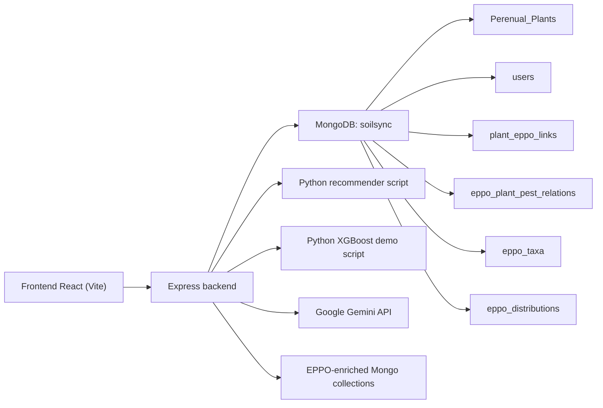

# SoilSync teljes rendszerleírás

Ez a dokumentum a jelenlegi kódbázis alapján írja le a SoilSync teljes működését:

- a publikus landing oldalt és plant library-t,
- az auth, email verification és password reset flow-kat,
- a `Recommender` és az `AI Garden Planner` működését,
- a profil, kedvencek és mentett kertek logikáját,
- a növényadatlap és EPPO-alapú kártevőintelligencia kapcsolatát,
- valamint az admin felületet és a hozzá tartozó backend endpointokat.

A cél nem egy elméleti architektúra leírása, hanem a jelenlegi implementáció tényleges felépítésének rögzítése:

- melyik adat melyik fájlban van,
- honnan érkezik,
- melyik komponens dolgozza fel,
- hova megy tovább,
- és mi történik közben a backendben, Python scriptekben, MongoDB-ben és a frontendben.

## 1. Rövid összkép

A SoilSync fő rendszerblokkjai:

1. `Public entry`
   Landing oldal és plant library, ahol a user böngészni tudja a növényadatbázist, beléphet a rendszerbe, vagy továbbléphet a recommender/planner felé.

2. `Auth és account`
   Regisztráció, email verifikáció, login, password reset, profiladatok és user session.

3. `Recommender`
   Célja: a felhasználó preferenciái alapján növényajánlás készítése.

4. `Planner`
   Célja: kiválasztott növényekből AI-val kertképet generálni, opcionálisan egy feltöltött saját kertfotó módosításával.

5. `Plant intelligence`
   Részletes növényoldal, EPPO-match, lokális pest risk és kapcsolódó taxon/distribution adatok.

6. `Admin`
   Felhasználók szerepkör-kezelése, manuális növényfelvitel és plant catalog státuszok kezelése.

Az intelligens modulok és a publikus katalógus ugyanarra a központi növényadatbázisra épülnek:

- MongoDB adatbázis: `soilsync`
- fő növénykollekció: `Perenual_Plants`

A backend nagy része jelenleg egy monolit fájlban van:

- [Backend/Server.js](C:\Users\barth\Documents\IVev\AllamvizsgaReborn\SoilSync\Backend\Server.js)

Ez a fájl kezeli:

- az authot,
- a növénylistát,
- a recommender endpointokat,
- a planner endpointokat,
- a mentett kerteket,
- az EPPO alapú kártevő-kockázatot,
- az admin funkciókat.

## 2. Magas szintű architektúra



## 3. Fő fájlok és szerepük

### Frontend

- [Frontend/src/Pages/LandingPage.jsx](C:\Users\barth\Documents\IVev\AllamvizsgaReborn\SoilSync\Frontend\src\Pages\LandingPage.jsx)
  A publikus belépési pont. Véletlenszerű mintát kér le a plant catalogból, statisztikákat mutat, és a user állapotától függően a register/login vagy a recommender/planner felé terel.

- [Frontend/src/Pages/Recommender.jsx](C:\Users\barth\Documents\IVev\AllamvizsgaReborn\SoilSync\Frontend\src\Pages\Recommender.jsx)
  A recommender UI-ja. Itt gyűlnek össze a felhasználó preferenciái, és innen indul a kérés a backend felé.

- [Frontend/src/Pages/GardenDrawer.jsx](C:\Users\barth\Documents\IVev\AllamvizsgaReborn\SoilSync\Frontend\src\Pages\GardenDrawer.jsx)
  A planner UI-ja. Itt történik a növénykeresés, kedvencek hozzáadása, referenciafotó feltöltés, AI generálás, plant guide bekapcsolása, mentés.

- [Frontend/src/context/AuthContext.jsx](C:\Users\barth\Documents\IVev\AllamvizsgaReborn\SoilSync\Frontend\src\context\AuthContext.jsx)
  A bejelentkezett user és a kedvencek globális kliensoldali állapota.

- [Frontend/src/Pages/ProfilePage.jsx](C:\Users\barth\Documents\IVev\AllamvizsgaReborn\SoilSync\Frontend\src\Pages\ProfilePage.jsx)
  A mentett kertek és a kedvencek megjelenítése. A user `location` mezője innen is fontos, mert ezt használja a rendszer a helyi pest risk számításhoz.

- [Frontend/src/Pages/PlantList.jsx](C:\Users\barth\Documents\IVev\AllamvizsgaReborn\SoilSync\Frontend\src\Pages\PlantList.jsx)
  A publikus plant library. Saját kereső- és szűrőfelülete van, és ugyanazt a növénylistás backend endpointot használja, amelyre a planner keresője is támaszkodik.

- [Frontend/src/Pages/PlantDetails.jsx](C:\Users\barth\Documents\IVev\AllamvizsgaReborn\SoilSync\Frontend\src\Pages\PlantDetails.jsx)
  A részletes növényoldal. Az EPPO adatok és a kártevő-kockázat itt látható teljes részletességgel.

- [Frontend/src/Pages/AdminPage.jsx](C:\Users\barth\Documents\IVev\AllamvizsgaReborn\SoilSync\Frontend\src\Pages\AdminPage.jsx)
  Az admin dashboard. User role kezelés, plant review/search, catalog status frissítés és manuális növényfelvitel történik itt.

- [Frontend/src/components/SignInForm.jsx](C:\Users\barth\Documents\IVev\AllamvizsgaReborn\SoilSync\Frontend\src\components\SignInForm.jsx)
  Login UI. `identifier + password` párost küld a backendnek, majd a JWT-t az `AuthContext` kezeli.

- [Frontend/src/components/SignUpForm.jsx](C:\Users\barth\Documents\IVev\AllamvizsgaReborn\SoilSync\Frontend\src\components\SignUpForm.jsx)
  Regisztrációs UI. A backend felé új usert hoz létre, majd email verifikációt kér.

- [Frontend/src/components/ForgotPassword.jsx](C:\Users\barth\Documents\IVev\AllamvizsgaReborn\SoilSync\Frontend\src\components\ForgotPassword.jsx)
  Password reset kezdeményezése email cím alapján.

- [Frontend/src/components/ResetPassword.jsx](C:\Users\barth\Documents\IVev\AllamvizsgaReborn\SoilSync\Frontend\src\components\ResetPassword.jsx)
  Password reset véglegesítése token alapú URL-ből.

- [Frontend/src/App.jsx](C:\Users\barth\Documents\IVev\AllamvizsgaReborn\SoilSync\Frontend\src\App.jsx)
  Route definíciók a public, auth, profile, admin, recommender és planner oldalakhoz.

- [Frontend/src/main.jsx](C:\Users\barth\Documents\IVev\AllamvizsgaReborn\SoilSync\Frontend\src\main.jsx)
  React belépési pont és `BrowserRouter`.

### Backend

- [Backend/Server.js](C:\Users\barth\Documents\IVev\AllamvizsgaReborn\SoilSync\Backend\Server.js)
  Központi API és üzleti logika.

- [Backend/models/Plant.js](C:\Users\barth\Documents\IVev\AllamvizsgaReborn\SoilSync\Backend\models\Plant.js)
  A `Perenual_Plants` collection modellje.

- [Backend/models/User.js](C:\Users\barth\Documents\IVev\AllamvizsgaReborn\SoilSync\Backend\models\User.js)
  A felhasználó modell. Ebben vannak a `favourites` és az embedded `savedGardens` adatok.

- [Backend/utils/sendEmail.js](C:\Users\barth\Documents\IVev\AllamvizsgaReborn\SoilSync\Backend\utils\sendEmail.js)
  Email verification és password reset emailek küldése.

- [Backend/utils/pestRisk.js](C:\Users\barth\Documents\IVev\AllamvizsgaReborn\SoilSync\Backend\utils\pestRisk.js)
  Helyalapú EPPO pest risk kiszámítása és recommender találatokhoz való hozzáfűzése.

- [Backend/scripts/xgboost_recommender_demo.py](C:\Users\barth\Documents\IVev\AllamvizsgaReborn\SoilSync\Backend\scripts\xgboost_recommender_demo.py)
  Az XGBoost demo ranking motor.

### EPPO háttérmodell és sync

- [Backend/models/PlantEppoLink.js](C:\Users\barth\Documents\IVev\AllamvizsgaReborn\SoilSync\Backend\models\PlantEppoLink.js)
  Perenual növény és EPPO taxon összekötése.

- [Backend/models/EppoPlantPestRelation.js](C:\Users\barth\Documents\IVev\AllamvizsgaReborn\SoilSync\Backend\models\EppoPlantPestRelation.js)
  Növény- és kártevőkapcsolatok.

- [Backend/models/EppoTaxon.js](C:\Users\barth\Documents\IVev\AllamvizsgaReborn\SoilSync\Backend\models\EppoTaxon.js)
  EPPO taxon részletes metaadatok és fotók.

- [Backend/models/EppoDistribution.js](C:\Users\barth\Documents\IVev\AllamvizsgaReborn\SoilSync\Backend\models\EppoDistribution.js)
  Országonkénti elterjedési adatok.

- [Backend/models/EppoSyncRun.js](C:\Users\barth\Documents\IVev\AllamvizsgaReborn\SoilSync\Backend\models\EppoSyncRun.js)
  Szinkronfutások naplója.

- [Backend/scripts/preparePlantEppoLinks.js](C:\Users\barth\Documents\IVev\AllamvizsgaReborn\SoilSync\Backend\scripts\preparePlantEppoLinks.js)
  Kiépíti az alap összekötő rekordokat a Perenual növényekhez.

- [Backend/scripts/matchPlantsToEppo.js](C:\Users\barth\Documents\IVev\AllamvizsgaReborn\SoilSync\Backend\scripts\matchPlantsToEppo.js)
  Tudományos név alapján EPPO match-et keres.

- [Backend/scripts/syncMatchedPlantPests.js](C:\Users\barth\Documents\IVev\AllamvizsgaReborn\SoilSync\Backend\scripts\syncMatchedPlantPests.js)
  A már összepárosított növényekhez lehúzza a pest kapcsolatokat.

## 4. Adatforrások

### 4.1 Elsődleges növényadat

Forrás:

- MongoDB `Perenual_Plants` collection
- modell: [Backend/models/Plant.js](C:\Users\barth\Documents\IVev\AllamvizsgaReborn\SoilSync\Backend\models\Plant.js)

Fontos mezők:

- `id`
- `common_name`
- `scientific_name`
- `default_image.*`
- `details.type`
- `details.watering`
- `details.care_level`
- `details.cycle`
- `details.sunlight`
- `details.soil`
- `details.growth_rate`
- `details.hardiness.min`
- `details.hardiness.max`
- `details.medicinal`
- `details.toxicity.pets`
- `details.toxicity.humans`
- `details.origin`

Ezt használja:

- növénylista,
- növényrészletek,
- recommender,
- planner növénykereső,
- planner referenciafotó-gyűjtés,
- mentett kertekben a kiválasztott növény-meta.

### 4.2 Felhasználói adatok

Forrás:

- MongoDB `users` collection
- modell: [Backend/models/User.js](C:\Users\barth\Documents\IVev\AllamvizsgaReborn\SoilSync\Backend\models\User.js)

Fontos mezők:

- `name`
- `email`
- `password`
- `verified`
- `profileImage`
- `bio`
- `location`
- `role`
- `systemRole`
- `favourites: number[]`
- `savedGardens: []`

### 4.3 EPPO háttéradat

Forrás:

- EPPO API-ból előre szinkronizált Mongo kollekciók

Érintett táblák:

- `plant_eppo_links`
- `eppo_plant_pest_relations`
- `eppo_taxa`
- `eppo_distributions`
- `eppo_sync_runs`

Ezt használja:

- recommender találatokhoz hozzáadott `pest_risk`
- plant details oldalon az EPPO blokk és a pest lista

### 4.4 AI szolgáltatás

Forrás:

- Google Gemini API

Felhasználás:

- planner képgenerálás
- planner plant guide marker-ek
- legacy SVG garden endpoint

## 5. Recommender teljes működése

## 5.1 Frontend belépési pont

Fájl:

- [Frontend/src/Pages/Recommender.jsx](C:\Users\barth\Documents\IVev\AllamvizsgaReborn\SoilSync\Frontend\src\Pages\Recommender.jsx)

A komponens induláskor lekéri az opciókat:

- `GET /api/recommender/options`

A felhasználó itt adhat meg:

- `sunlight`
- `watering`
- `care_level`
- `hardiness_zone`
- `soil`
- `type`
- `cycle`
- `low_maintenance`
- `fast_growth`
- `pet_safe`
- `medicinal`

További fontos logika:

- ha a user profiljában van `location`, akkor az bekerül a payloadba `viewer_location` néven,
- az üres és `false` mezők ki lesznek dobva a requestből,
- a frontend a jelenlegi implementációban egységesen az XGBoost-alapú recommender endpointot hívja.

## 5.2 Recommender opciók honnan jönnek

Backend route:

- `GET /api/recommender/options`
- fájl: [Backend/Server.js](C:\Users\barth\Documents\IVev\AllamvizsgaReborn\SoilSync\Backend\Server.js)

Folyamat:

1. A backend lekéri az összes növényt a `Perenual_Plants` collectionből, de csak a `details` mezőt.
2. A `collectDistinctValues` segédfüggvény összegyűjti az egyedi értékeket.
3. A `canonicalize*` függvények normalizálják őket.

Példák:

- `details.sunlight` -> `full sun`, `part shade`, `full shade`
- `details.watering` -> `Frequent`, `Average`, `Minimum`
- `details.type` -> `Tree`, `Shrub`, `Flower`, stb.

Tehát itt nincs külön konfigurációs fájl az opciókhoz, hanem a rendszer az adatbázisból generálja őket.

## 5.3 Recommender futtatási flow

Frontend request:

- `POST /api/recommender/xgb`

Backend route:

- [Backend/Server.js](C:\Users\barth\Documents\IVev\AllamvizsgaReborn\SoilSync\Backend\Server.js)

Lépések:

1. A backend meghívja a `runPrimaryPlantRecommender` függvényt.
2. A `runPrimaryPlantRecommender` a jelenlegi implementációban a `runXgbPlantRecommender` ágra irányít.
3. A backend elindítja a Python scriptet:
   - [Backend/scripts/xgboost_recommender_demo.py](C:\Users\barth\Documents\IVev\AllamvizsgaReborn\SoilSync\Backend\scripts\xgboost_recommender_demo.py)
4. A Node process JSON payloadot küld a Python stdin-jére:
   - `plants`
   - `prefs`
   - `top_k`
5. A Python script visszaad egy JSON tömböt a top találatokkal.
6. A backend ezeket dúsítja EPPO pest risk adatokkal.
7. A frontend megjeleníti az eredményt.

### Fontos részlet

A jelenlegi recommender script közvetlenül MongoDB-ből olvas, és a Node backend már csak a preferenciákat és a kimeneti adaptációt kezeli.

## 5.4 Recommender adat-transzformáció

Fájl:

- [Backend/scripts/xgboost_recommender_demo.py](C:\Users\barth\Documents\IVev\AllamvizsgaReborn\SoilSync\Backend\scripts\xgboost_recommender_demo.py)

Fő lépések:

1. `flatten_plant_data`
   A nyers Mongo dokumentumokat lapos ML-barát táblává alakítja.

2. Modell feature-ek:

- `type`
- `growth_rate`
- `care_level`
- `maintenance`
- `cycle`
- `watering`
- `sunlight`
- `soil`
- `propagation`
- `origin`
- `hardiness_min`
- `hardiness_max`
- `medicinal`
- `toxic_to_pets`
- `toxic_to_humans`

3. A script feature-engineering lépéseket futtat a nyers növényadatokon.
4. Ezután ranking logikával és modellpontszámokkal állítja elő a shortlistet.
5. Kimeneti mezők:

- `id`
- `common_name`
- `latin_name`
- `image_url`
- `score`
- `fit_label`
- `why_it_fits`
- `risk_flags`
- `breakdown`
- `similarity`
- `watering`
- `care_level`
- `type`
- `cycle`
- `pet_safe`

### Milyen user preferenciákat használ ténylegesen ez a réteg

- `watering`
- `care_level`
- `sunlight`
- `soil`
- `type`
- `cycle`
- `low_maintenance`
- `fast_growth`
- `medicinal`
- `hardiness_zone`
- `pet_safe`

### Fontos scoring logika

- fény egyezés: plusz pont
- vízigény egyezés: plusz pont
- talaj egyezés: plusz pont
- hardiness zone illeszkedés: plusz pont, eltérés esetén mínusz
- pet safe igény és toxikusság: erős büntetés

Ez a blokk történetileg részben egy korábbi megoldásból maradt, de a jelenlegi alkalmazásban a futó recommender ág XGBoost-alapú.

## 5.5 XGBoost recommender flow

Frontend request:

- `POST /api/recommender/xgb`

Backend route:

- [Backend/Server.js](C:\Users\barth\Documents\IVev\AllamvizsgaReborn\SoilSync\Backend\Server.js)

Lépések:

1. A backend a `runXgbPlantRecommender` függvényt hívja.
2. A Node nem küldi át a teljes növénylistát.
3. Ehelyett CLI argumentumokat épít a user preferenciákból.
4. Elindítja:
   - [Backend/scripts/xgboost_recommender_demo.py](C:\Users\barth\Documents\IVev\AllamvizsgaReborn\SoilSync\Backend\scripts\xgboost_recommender_demo.py)
5. A Python script saját maga csatlakozik a MongoDB-hez és beolvassa a növényeket.
6. A script szintetikus query-ket generál, pseudo label-eket épít, betanít egy demo rangsorolót.
7. Ugyanabban a futásban lefuttatja az inference-t az aktuális user profilra.
8. JSON summary-t ad vissza.
9. A Node ezt frontend-kompatibilis formára alakítja.
10. Utána ugyanúgy hozzáfűzi a pest risk adatot.

### Milyen preferenciákat használ ténylegesen az XGB demo

A frontend is kiírja, és a backend/Python is ezt támasztja alá:

- `watering`
- `care_level`
- `type`
- `cycle`
- `hardiness_zone`
- `low_maintenance`

Ez fontos, mert:

- `sunlight`
- `soil`
- `fast_growth`
- `pet_safe`
- `medicinal`

látszik a formban, de az XGBoost demo jelenleg nem ezeken tanul.

## 5.6 Pest risk hozzáadás a recommender találatokhoz

Fájl:

- [Backend/utils/pestRisk.js](C:\Users\barth\Documents\IVev\AllamvizsgaReborn\SoilSync\Backend\utils\pestRisk.js)

Folyamat:

1. A recommender találatokból a rendszer kiveszi a `plant.id` értékeket.
2. A `PlantEppoLink` alapján megkeresi, melyik Perenual növény milyen EPPO kóddal van összekötve.
3. A user `viewer_location` vagy `location` mezőjéből ország-kontekstust próbál képezni.
4. Az `EppoPlantPestRelation` alapján megkeresi az összes kapcsolt kártevőt.
5. Az `EppoDistribution` alapján megnézi, melyek vannak jelen az adott országban.
6. Ebből készül:

- `pest_risk.label`
- `pest_risk.summary`
- `pest_risk.warnings`
- `risk_flags` bővítése

Tehát a recommender végső eredménye nem csak ajánlás, hanem lokációfüggő növény-egészségügyi kockázati kontextus is.

## 5.7 Recommender kimenet a frontendben

Fájl:

- [Frontend/src/Pages/Recommender.jsx](C:\Users\barth\Documents\IVev\AllamvizsgaReborn\SoilSync\Frontend\src\Pages\Recommender.jsx)

Megjelenített blokkok:

- pontszám,
- fit label,
- why it fits,
- pest risk,
- risk flags,
- alap növénytulajdonságok,
- debug nézetben teljes `breakdown`.

További UI kapcsolat:

- ha a user be van jelentkezve, kedvencek közé teheti a találatokat,
- ez a `toggleFavourite` híváson át a user document `favourites` mezőjét módosítja.

## 6. Planner teljes működése

## 6.1 Frontend belépési pont

Fájl:

- [Frontend/src/Pages/GardenDrawer.jsx](C:\Users\barth\Documents\IVev\AllamvizsgaReborn\SoilSync\Frontend\src\Pages\GardenDrawer.jsx)

Ez a komponens kezeli:

- kiválasztott növény slotok,
- élő növénykeresés,
- kedvenc növények beemelése,
- design brief,
- referenciafotó feldolgozás,
- AI generálás,
- variációk kezelése,
- plant guide marker-ek,
- mentés profilba.

## 6.2 Planner state-ek és kliensoldali adatfolyam

Fő state-ek:

- `plantInputs`
- `designBrief`
- `referenceMode`
- `referenceGardenPhoto`
- `gardenImage`
- `generatedImages`
- `plantGuide`
- `favouritePlants`

### `plantInputs`

Szerkezet:

- `localId`
- `dbId`
- `query`
- `selectedPlant`

Ez a planner fő kiválasztási állapota.

### `designBrief`

Default:

- `spaceType`
- `style`
- `mood`
- `maintenanceLevel`
- `hardscape`
- `density`
- `realismLevel`
- `budgetLevel`
- `extraDirections`

Ez megy át a backend promptépítésbe.

### `referenceGardenPhoto`

Előállítás:

1. a user feltölt egy képfájlt,
2. a frontend beolvassa `FileReader`-rel,
3. canvason újraméretezi,
4. JPEG data URL-t készít,
5. tárolja:

- `name`
- `mimeType`
- `data` base64
- `previewUrl`
- `width`
- `height`

Ez a planner fontos adatútja, mert ezt küldi át a backend Gemini image-edit kérésébe.

## 6.3 Planner növénykeresés

Frontend:

- [Frontend/src/Pages/GardenDrawer.jsx](C:\Users\barth\Documents\IVev\AllamvizsgaReborn\SoilSync\Frontend\src\Pages\GardenDrawer.jsx)

API:

- `GET /plants?page=1&limit=6&search=<query>`

Backend:

- [Backend/Server.js](C:\Users\barth\Documents\IVev\AllamvizsgaReborn\SoilSync\Backend\Server.js)

Adatforrás:

- `Perenual_Plants`

Mi történik:

1. a felhasználó 250 ms debounce után keres,
2. a backend regexes keresést csinál több mezőn,
3. a találatokat visszaadja,
4. a frontend a teljes plant objektumot eltárolja a `selectedPlant` mezőben.

Ez azért fontos, mert innen származik:

- a planner vizuális plant cardja,
- a selected plant lista,
- a későbbi mentéshez a növény meta,
- és a backend kérésben a `selectedPlantIds`.

## 6.4 Planner kedvencek adatútja

Frontend:

- a planner betöltéskor `GET /favourites`

Backend:

- `GET /favourites`

Adatút:

1. `User.favourites` egy szám tömb.
2. A backend ezek alapján lehúzza a megfelelő növényeket a `Perenual_Plants` collectionből.
3. A frontend ezeket `favouritePlants` state-be teszi.
4. A user egy kattintással hozzá tudja adni őket a planner `plantInputs` listájához.

## 6.5 Planner AI generálás fő request

Frontend request:

- `POST /api/generate-photorealistic-garden`

Body:

- `selectedPlantIds`
- `gardenStyle`
- `designPreferences`
- `variationCount`
- `referenceGardenPhoto | null`

Frontend fájl:

- [Frontend/src/Pages/GardenDrawer.jsx](C:\Users\barth\Documents\IVev\AllamvizsgaReborn\SoilSync\Frontend\src\Pages\GardenDrawer.jsx)

Backend route:

- [Backend/Server.js](C:\Users\barth\Documents\IVev\AllamvizsgaReborn\SoilSync\Backend\Server.js)

## 6.6 Planner backend feldolgozás

Lépések:

1. auth ellenőrzés szükséges,
2. a backend ellenőrzi, hogy van-e `selectedPlantIds`,
3. a backend lekéri a kiválasztott növényeket `Perenual_Plants`-ból,
4. a kiválasztási sorrendet megtartja `orderedPlants` formában,
5. normalizálja a design briefet `normalizeGardenDesignPreferences` segítségével,
6. ha van feltöltött kép, abból Gemini kompatibilis image part készül,
7. minden kiválasztott növényhez megpróbál referenciafotót tölteni a növény `default_image.*` URL-jeiből,
8. ezekből prompt és multimodális input készül,
9. a backend Gemini image modellt hív,
10. akár több variációt is készít,
11. a képeket data URL-ként visszaadja a frontendnek.

### Növény referenciafotók honnan jönnek

Nem külön tárolt assetből, hanem:

- a `Perenual_Plants.default_image` mezőiből,
- a backend `axios`-szal letölti őket,
- base64-re alakítja,
- és csatolja a Gemini kéréshez.

### Miért fontos ez

A planner nem csak növénynévvel promptol, hanem igyekszik vizuális fajhűséget is adni a modellnek.

## 6.7 Planner promptépítés

Fájl:

- [Backend/Server.js](C:\Users\barth\Documents\IVev\AllamvizsgaReborn\SoilSync\Backend\Server.js)

Kapcsolódó helper-ek:

- `normalizeGardenDesignPreferences`
- `getSpaceConstraintGuidance`
- `getPlantRecognitionCue`
- `getPlantSpaceAdaptationHint`
- `buildPlantPromptLine`
- `buildGardenPrompt`
- `buildGardenPromptVariants`

Ezek szerepe:

- a selected plant listából olvasható promptsort készítenek,
- figyelembe veszik a hely típusát,
- figyelembe veszik a stílust,
- figyelembe veszik a realizmust és a budgetet,
- próbálják kikényszeríteni, hogy minden kiválasztott növény tényleg látszódjon a képen.

Példa arra, hogy milyen adatok mennek be a promptba:

- növény neve,
- latin név,
- növénytípus,
- fényigény,
- vízigény,
- hardiness,
- felismerési cue-k,
- kompakt térhez igazítás,
- design brief stílus és hangulat,
- extra directions,
- referenciafotó megléte vagy hiánya.

## 6.8 Planner AI modell és kimenet

Használt modell:

- `gemini-3.1-flash-image-preview`

Kimenet:

- a response `IMAGE` partjából base64 kép
- frontend felé:
  - `imageBase64`
  - `images`
  - `variationCount`
  - `generationMode`

Frontend oldalon:

- `generatedImages` tömbbe kerül
- `gardenImage` az aktuálisan kiválasztott verzió

## 6.9 Variációk kezelése

Frontend:

- [Frontend/src/Pages/GardenDrawer.jsx](C:\Users\barth\Documents\IVev\AllamvizsgaReborn\SoilSync\Frontend\src\Pages\GardenDrawer.jsx)

Mi történik:

1. a user kérhet több variációt,
2. a backend maximum 3-at generál,
3. a frontend az összeset `generatedImages` tömbbe rakja,
4. a user kiválaszt egyet,
5. a kiválasztott index elmentődik `activeVariationIndex` mezőbe.

Ez később mentéskor is bekerül a user saved garden rekordjába.

## 6.10 Planner plant guide

Frontend request:

- `POST /api/garden-plant-guide`

Body:

- `selectedPlantIds`
- `imageData`
- `designPreferences`

Backend route:

- [Backend/Server.js](C:\Users\barth\Documents\IVev\AllamvizsgaReborn\SoilSync\Backend\Server.js)

Folyamat:

1. a frontend elküldi a generált képet data URL-ként,
2. a backend kinyeri belőle a mime type-ot és a base64-et,
3. lekéri a kiválasztott növényeket a MongoDB-ből,
4. promptot épít:
   - melyik növénynek kellene látszania,
   - milyen névvel,
   - milyen leíró tulajdonságokkal,
5. a Gemini `gemini-2.5-flash` modell JSON választ ad vissza,
6. a backend csak a valid marker-eket tartja meg `normalizeGuideMarkers` segítségével,
7. a frontend overlay-ként rajzolja rá a marker-eket a képre.

Fontos:

- a plant guide adatok nem kerülnek adatbázisba,
- ezek teljesen futásidejű, ideiglenes adatok.

## 6.11 Planner képmentés

Frontend request:

- `POST /saved-gardens`

Payload:

- `title`
- `image`
- `referenceImage`
- `usedReferencePhoto`
- `gardenStyle`
- `variationIndex`
- `selectedPlants[]`

Backend route:

- `POST /saved-gardens`

Mi történik:

1. auth ellenőrzés,
2. ellenőrzés, hogy az `image` data URL formátumú legyen,
3. a backend a user documentet betölti,
4. normalizálja a plant listát,
5. létrehoz egy embedded `savedGarden` objektumot,
6. a user `savedGardens` tömb elejére rakja,
7. maximum 40 mentett kert marad meg.

Tárolási hely:

- `users.savedGardens`

Ez azt jelenti, hogy a mentett kertek nem külön collectionben vannak, hanem a user dokumentumba vannak beágyazva.

### A saved garden rekord szerkezete

Forrás:

- [Backend/models/User.js](C:\Users\barth\Documents\IVev\AllamvizsgaReborn\SoilSync\Backend\models\User.js)

Mezők:

- `title`
- `image`
- `referenceImage`
- `usedReferencePhoto`
- `gardenStyle`
- `variationIndex`
- `plants[]`
- `savedAt`

### Mit tárol ténylegesen

- a generált kép teljes base64 data URL-jét,
- opcionálisan a referenciafotó preview-ját,
- a kiválasztott növények nevét és ID-ját,
- a stílust,
- az időpontot.

## 6.12 Planner mentett kertek visszatöltése

Frontend:

- [Frontend/src/Pages/ProfilePage.jsx](C:\Users\barth\Documents\IVev\AllamvizsgaReborn\SoilSync\Frontend\src\Pages\ProfilePage.jsx)

API:

- `GET /saved-gardens`
- `DELETE /saved-gardens/:gardenId`

Adatút:

1. profil oldal betöltéskor lekéri a mentett kerteket,
2. a backend a user `savedGardens` tömbjét adja vissza,
3. a frontend megmutatja a preview képet,
4. a user letöltheti vagy törölheti.

## 7. Növényadatlap és EPPO kapcsolat

Bár ez nem közvetlenül a planner UI része, a recommender és a részletes növényoldal közös háttérlogikát használ.

Route:

- `GET /plants/:id`

Backend folyamat:

1. lekéri a növényt a `Perenual_Plants` collectionből,
2. lekéri a hozzá tartozó `PlantEppoLink` rekordot,
3. ha matched:
   - lekéri a kapcsolt pests rekordokat,
   - lekéri a taxon adatot,
   - lekéri az elterjedési adatokat,
4. kiszámolja a viewer location szerinti `pestRisk` objektumot,
5. a frontend felé egy dúsított plant objektumot ad vissza.

Ezért tud a Plant Details oldal egyszerre megjeleníteni:

- botanikai adatokat,
- origin országokat,
- EPPO taxon azonosítást,
- elterjedést,
- pest listát,
- lokális jelenlétet.

Technikai megjegyzés:

- A [Frontend/src/Pages/PlantDetails.jsx](C:\Users\barth\Documents\IVev\AllamvizsgaReborn\SoilSync\Frontend\src\Pages\PlantDetails.jsx) jelenleg még próbál hívni egy `GET /plants/:id/guides` route-ot is.
- A jelenlegi [Backend/Server.js](C:\Users\barth\Documents\IVev\AllamvizsgaReborn\SoilSync\Backend\Server.js) fájlban ehhez nem látszik aktív backend route.
- Ez azt jelenti, hogy ez a hívás jelenleg vagy régi maradvány, vagy részben még vissza nem kötött funkció.

## 8. Public UI, auth, profile és admin kapcsolata a fő modulokkal

### 8.1 Landing page és publikus belépési pontok

Fő route-ok a [Frontend/src/App.jsx](C:\Users\barth\Documents\IVev\AllamvizsgaReborn\SoilSync\Frontend\src\App.jsx) alapján:

- `/`
- `/plants`
- `/plant/:id`
- `/login`
- `/register`
- `/forgot-password`
- `/reset-password/:token`
- `/recommender`
- `/garden-drawer`
- `/profile`
- `/admin`

A landing oldal:

- a [Frontend/src/Pages/LandingPage.jsx](C:\Users\barth\Documents\IVev\AllamvizsgaReborn\SoilSync\Frontend\src\Pages\LandingPage.jsx) komponensben él,
- betöltéskor lekér egy véletlen oldalt a plant catalogból:
  - `GET /plants?page=<random>&limit=8`
- a user login állapotától függően más CTA-kat mutat,
- planner gombnál:
  - ha van user -> `/garden-drawer`
  - ha nincs user -> `/login`
- elsődleges CTA-nál:
  - ha van user -> `/recommender`
  - ha nincs user -> `/register`

Ezért a landing page nem statikus marketing oldal, hanem élő belépési pont a valódi növénykatalógus felé.

### 8.2 Publikus plant library és catalog routing

Frontend:

- [Frontend/src/Pages/PlantList.jsx](C:\Users\barth\Documents\IVev\AllamvizsgaReborn\SoilSync\Frontend\src\Pages\PlantList.jsx)

Backend:

- `GET /plants`
- `GET /plants/:id`

A `PlantList` oldal:

- paginált listát kér le a backendtől,
- támogatja a `search`, `watering`, `sunlight`, `care_level`, `type`, `cycle`, `origin` filtereket,
- kliensoldalon "smart search" logikát is használ:
  - például a keresőszövegből implicit filtereket vezet le,
  - így a search mező nem csak teljes szöveges keresés, hanem részben intent-alapú szűrés is.

A backend `GET /plants` route:

- reguláris kifejezésekkel keres több mezőben,
- külön filtereli a `details.*` mezőket,
- támogat origin országot és origin-régiót is,
- a landing oldal, a publikus library és részben a planner keresője is erre a catalog endpointre támaszkodik.

### 8.3 Auth teljes flow

Frontend fájlok:

- [Frontend/src/context/AuthContext.jsx](C:\Users\barth\Documents\IVev\AllamvizsgaReborn\SoilSync\Frontend\src\context\AuthContext.jsx)
- [Frontend/src/components/SignInForm.jsx](C:\Users\barth\Documents\IVev\AllamvizsgaReborn\SoilSync\Frontend\src\components\SignInForm.jsx)
- [Frontend/src/components/SignUpForm.jsx](C:\Users\barth\Documents\IVev\AllamvizsgaReborn\SoilSync\Frontend\src\components\SignUpForm.jsx)
- [Frontend/src/components/ForgotPassword.jsx](C:\Users\barth\Documents\IVev\AllamvizsgaReborn\SoilSync\Frontend\src\components\ForgotPassword.jsx)
- [Frontend/src/components/ResetPassword.jsx](C:\Users\barth\Documents\IVev\AllamvizsgaReborn\SoilSync\Frontend\src\components\ResetPassword.jsx)

Backend route-ok:

- `POST /register`
- `GET /verify/:token`
- `POST /forgot-password`
- `POST /reset-password/:token`
- `POST /login`
- `GET /profile`
- `PUT /profile/update`

Regisztrációs flow:

1. A `SignUpForm` elküldi a `name`, `email`, `password` mezőket a `POST /register` route-ra.
2. A backend létrehoz egy usert `verificationToken` mezővel.
3. A backend a [Backend/utils/sendEmail.js](C:\Users\barth\Documents\IVev\AllamvizsgaReborn\SoilSync\Backend\utils\sendEmail.js) segítségével verifikációs emailt küld.
4. A user a `GET /verify/:token` linken hitelesíti az email címét.

Login flow:

1. A `SignInForm` `identifier + password` párost küld a `POST /login` route-ra.
2. Az `identifier` lehet email vagy usernév.
3. A backend csak verifikált usert enged be.
4. Siker esetén 7 napos JWT token készül.
5. A frontend az `AuthContext`-en keresztül a `localStorage`-be menti a tokent.

Password reset flow:

1. A `ForgotPassword` oldal a `POST /forgot-password` route-ra küldi az emailt.
2. A backend `passwordResetToken` és `passwordResetExpires` értéket ment a userhez.
3. A `sendPasswordResetEmail` egy frontend URL-re mutató reset linket küld.
4. A `ResetPassword` oldal a token alapján a `POST /reset-password/:token` route-on véglegesíti az új jelszót.

JWT session flow:

1. login után token kerül a `localStorage`-be,
2. az `AuthContext` induláskor `GET /profile` hívással betölti a jelenlegi usert,
3. védett route-ok `Authorization: Bearer <token>` fejlécet várnak,
4. az `AuthContext` számolja az `isAdmin` és `isSuperAdmin` flag-eket is a `systemRole` alapján.

### 8.4 Profil, kedvencek és mentett kertek

Fő frontend fájl:

- [Frontend/src/Pages/ProfilePage.jsx](C:\Users\barth\Documents\IVev\AllamvizsgaReborn\SoilSync\Frontend\src\Pages\ProfilePage.jsx)

Kapcsolódó backend route-ok:

- `GET /profile`
- `PUT /profile/update`
- `POST /favourites/toggle`
- `GET /favourites`
- `GET /saved-gardens`
- `POST /saved-gardens`
- `DELETE /saved-gardens/:gardenId`

Ez a rész köti össze a user accountot a recommenderrel és a plannerrel:

- a recommender a user `location` mezőjét használja `viewer_location`-ként,
- a planner csak bejelentkezve működik,
- a kedvencek planner és recommender között megosztott user adatként működnek,
- a saved gardens a profiloldalon jelennek meg,
- a profilkép base64-ként kerülhet a user dokumentumba.

Frontend viselkedés:

- a `ProfilePage` külön tölti be a kedvenc növényeket és a mentett kerteket,
- a `handleSave` a profil mezőit a `PUT /profile/update` route-ra küldi,
- a mentett kertek törlése külön `DELETE /saved-gardens/:gardenId` hívással történik,
- a letöltés teljesen kliensoldali `data:image/*` linkből készül.

`AuthContext` szerepe:

- globálisan tárolja a bejelentkezett usert,
- betölti a favourites tömböt,
- optimista UI-val kezeli a `toggleFavourite` műveletet,
- `isFavourite`, `isAdmin` és `isSuperAdmin` helper-eket ad a teljes frontendnek.

### 8.5 Admin modul

Fő frontend fájl:

- [Frontend/src/Pages/AdminPage.jsx](C:\Users\barth\Documents\IVev\AllamvizsgaReborn\SoilSync\Frontend\src\Pages\AdminPage.jsx)

Kapcsolódó backend route-ok:

- `GET /admin/users`
- `PATCH /admin/users/:userId/system-role`
- `GET /admin/plants`
- `POST /admin/plants`
- `PATCH /admin/plants/:id/catalog-status`

Az admin UI két fő részre bontható:

1. `User administration`
   - userek lekérdezése,
   - `systemRole` módosítása,
   - admin/superadmin jogosultsági logika.

2. `Plant administration`
   - növények keresése és listázása,
   - `adminCatalogStatus` állapot kezelése,
   - manuális növényfelvitel a `Perenual_Plants` kollekcióba.

Fontos részlet:

- a `systemRole` külön mező a user dokumentumban,
- a `requireAdmin` és `requireSuperAdmin` middleware-ek védik az admin route-okat,
- a `catalogStatus` állapot jelen van az admin felületen,
- de a recommender és planner jelenlegi futása nincs közvetlenül erre szűrve.

## 9. Háttér EPPO adatfrissítési pipeline

Ez nem user-driven realtime folyamat, hanem előkészített háttéradat, de fontos a recommender `pest_risk` megértéséhez.

### 9.1 EPPO link rekord előkészítése

Fájl:

- [Backend/scripts/preparePlantEppoLinks.js](C:\Users\barth\Documents\IVev\AllamvizsgaReborn\SoilSync\Backend\scripts\preparePlantEppoLinks.js)

Forrás:

- `Perenual_Plants`

Cél:

- minden növényhez létrehozni egy `plant_eppo_links` rekordot normalizált tudományos névvel.

### 9.2 EPPO match keresés

Fájl:

- [Backend/scripts/matchPlantsToEppo.js](C:\Users\barth\Documents\IVev\AllamvizsgaReborn\SoilSync\Backend\scripts\matchPlantsToEppo.js)

Forrás:

- `plant_eppo_links`
- EPPO API

Cél:

- növényhez EPPO kódot rendelni.

Kimenet:

- `matchStatus`
- `eppoCode`
- `eppoPreferredName`
- `matchStrategy`

### 9.3 Pest kapcsolatok szinkronja

Fájl:

- [Backend/scripts/syncMatchedPlantPests.js](C:\Users\barth\Documents\IVev\AllamvizsgaReborn\SoilSync\Backend\scripts\syncMatchedPlantPests.js)

Forrás:

- matched EPPO linkek
- EPPO API

Kimenet:

- `eppo_plant_pest_relations`
- kapcsolódó taxon és distribution adatok más sync scriptekből

## 10. Nem közvetlenül használt, legacy vagy külön megjegyzendő elemek

### Legacy recommender route

Route:

- `POST /api/recommender`

Ez egy régebbi változat, a jelenlegi frontend nem ezt használja.

### Legacy garden SVG route

Route:

- `POST /api/generate-garden`

Ez SVG-t generál `gemini-1.5-flash` modellel. A jelenlegi planner nem ezt használja, hanem a fotórealisztikus route-ot.

### Admin catalog status megjegyzés

Fájlok:

- [Backend/Server.js](C:\Users\barth\Documents\IVev\AllamvizsgaReborn\SoilSync\Backend\Server.js)
- [Frontend/src/Pages/AdminPage.jsx](C:\Users\barth\Documents\IVev\AllamvizsgaReborn\SoilSync\Frontend\src\Pages\AdminPage.jsx)

Van `adminCatalogStatus` mező és export script is:

- [Backend/scripts/exportRecommendablePlants.js](C:\Users\barth\Documents\IVev\AllamvizsgaReborn\SoilSync\Backend\scripts\exportRecommendablePlants.js)

Jelenleg viszont a recommender és planner működése nincs közvetlenül erre szűrve. Tehát a `recommendable/excluded` admin státusz inkább katalógus- és export-oldali logika, nem a jelenlegi live ajánlómotor fő szűrője.

## 11. Fájl-szintű adatút összefoglaló

## 11.1 Recommender

```text
Frontend/src/Pages/Recommender.jsx
  -> GET /api/recommender/options
  -> POST /api/recommender/xgb

Backend/Server.js
  -> Python script futtatás
     - scripts/xgboost_recommender_demo.py
  -> utils/pestRisk.js
  -> vissza JSON a frontendnek

Frontend/src/Pages/Recommender.jsx
  -> találatok renderelése
  -> opcionálisan favourites toggle
```

## 11.2 Planner

```text
Frontend/src/Pages/GardenDrawer.jsx
  -> GET /favourites
  -> GET /plants kereséshez
  -> referenciafotó előkészítés
  -> POST /api/generate-photorealistic-garden

Backend/Server.js
  -> selectedPlantIds alapján Perenual_Plants lekérdezés
  -> designPreferences normalizálás
  -> növény referenciafotók letöltése default_image URL-ekből
  -> Gemini image generation
  -> vissza images[]

Frontend/src/Pages/GardenDrawer.jsx
  -> variációk megjelenítése
  -> POST /api/garden-plant-guide

Backend/Server.js
  -> Gemini marker elemzés
  -> marker JSON vissza

Frontend/src/Pages/GardenDrawer.jsx
  -> POST /saved-gardens

Backend/Server.js
  -> User.savedGardens tömbbe mentés

Frontend/src/Pages/ProfilePage.jsx
  -> GET /saved-gardens
  -> saved garden lista render
```

## 11.3 Public catalog, auth és admin

```text
Frontend/src/Pages/LandingPage.jsx
  -> GET /plants?page=<random>&limit=8
  -> CTA routing login/register/recommender/planner felé

Frontend/src/Pages/PlantList.jsx
  -> GET /plants
  -> search + derived filter logika
  -> Link /plant/:id

Frontend/src/components/SignUpForm.jsx
  -> POST /register

Backend/Server.js
  -> User létrehozás verificationToken-nel
  -> utils/sendEmail.js
  -> GET /verify/:token

Frontend/src/components/SignInForm.jsx
  -> POST /login

Frontend/src/context/AuthContext.jsx
  -> JWT localStorage
  -> GET /profile
  -> isAdmin / isSuperAdmin

Frontend/src/Pages/ProfilePage.jsx
  -> PUT /profile/update
  -> GET /favourites
  -> GET /saved-gardens
  -> DELETE /saved-gardens/:gardenId

Frontend/src/Pages/AdminPage.jsx
  -> GET /admin/users
  -> PATCH /admin/users/:userId/system-role
  -> GET /admin/plants
  -> POST /admin/plants
  -> PATCH /admin/plants/:id/catalog-status
```

## 12. Adatmodell összefoglaló

### `Perenual_Plants`

Fő cél:

- központi plant catalog

Használja:

- plant list
- plant details
- recommender
- planner

### `users`

Fő cél:

- auth
- profil
- location
- favourites
- saved gardens

Használja:

- auth context
- recommender pest risk helyalaphoz
- planner favorites
- planner saved garden

### `plant_eppo_links`

Fő cél:

- Perenual plant ID -> EPPO kód mapping

### `eppo_plant_pest_relations`

Fő cél:

- növény és kártevő kapcsolatok

### `eppo_distributions`

Fő cél:

- országonkénti jelenlét

### `eppo_taxa`

Fő cél:

- EPPO taxon meta és fotó

## 13. Fontos technikai megfigyelések

1. A backend erősen monolitikus.
   A recommender, planner, auth, admin és plant detail logika ugyanabban a [Backend/Server.js](C:\Users\barth\Documents\IVev\AllamvizsgaReborn\SoilSync\Backend\Server.js) fájlban él.

2. A frontend URL-ek hardcoded `http://localhost:5000` címre mennek.
   Ez fejlesztésre jó, deploynál később konfigurálni kell.

3. A planner a generált képeket base64 data URL-ként menti a user dokumentumba.
   Ez egyszerű, de hosszú távon nagyra növelheti a `users` dokumentum méretét.

4. A recommender jelenleg egyetlen, egységes XGBoost-alapú architektúrát használ.
   A ranking script közvetlenül MongoDB-ből olvas, a backend pedig a kimenetet frontend-kompatibilis shortlistté alakítja.

5. A pest risk a user `location` mező minőségétől függ.
   Ha a location nincs kitöltve vagy nem felismerhető országként, a rendszer csak részleges pest risk információt tud adni.

6. A planner species fidelity-re van optimalizálva.
   A promptépítő helper-ek kifejezetten arra próbálják rávenni a modellt, hogy a kiválasztott fajok láthatóak és felismerhetőek maradjanak.

7. A `savedGardens` embedded tömb maximum 40 elemre van vágva.

8. A `selectedPlants` mentéskor maximum 12 növényre van korlátozva.

9. A `PlantDetails.jsx` frontend jelenleg hív egy `GET /plants/:id/guides` route-ot is.
   A jelenlegi backendben ehhez nem látszik aktív endpoint, tehát ez jelenleg részben bekötetlen vagy régi maradvány lehet.

10. Az [Backend/scripts/xgboost_recommender_demo.py](C:\Users\barth\Documents\IVev\AllamvizsgaReborn\SoilSync\Backend\scripts\xgboost_recommender_demo.py) docstringje még azt írja, hogy nem integrálódik a web appba.
    A tényleges rendszerben viszont a backend route valóban meghívja ezt a scriptet, tehát a jelenlegi működés megértéséhez a kódútvonal a mérvadó, nem a régi fejléc-komment.

## 14. Mi számít a recommender és planner minimális kritikus adatútjának

### Recommender kritikus adatút

```text
User input
-> Recommender.jsx formData
-> POST /api/recommender/xgb
-> Server.js route
-> Python scoring engine
-> pestRisk enrichment
-> frontend result cards
```

### Planner kritikus adatút

```text
User növényválasztás
-> GardenDrawer.jsx plantInputs
-> selectedPlantIds
-> POST /api/generate-photorealistic-garden
-> Server.js prompt + reference image assembly
-> Gemini image generation
-> generatedImages a frontendben
-> opcionálisan POST /saved-gardens
-> User.savedGardens
```

## 15. Rövid végkövetkeztetés

A jelenlegi rendszerben:

- a publikus belépési réteg a `LandingPage` + `PlantList` + `PlantDetails`,
- az `auth/account` réteg külön email verifikációs és password reset flow-val rendelkezik,
- a `Recommender` központja a `Perenual_Plants` adatbázis és a két Python ajánlómotor,
- a `Planner` központja a React oldali design state és a backend Gemini prompt-összeállítás,
- a `User` modell köti össze a személyes preferencia-jellegű adatokat:
  - location,
  - favourites,
  - saved gardens,
- az `Admin` külön modul a user role és plant catalog kezeléshez,
- az EPPO háttérkollekciók adják a kártevő-intelligenciát,
- és a teljes üzleti logika jelenleg döntően a [Backend/Server.js](C:\Users\barth\Documents\IVev\AllamvizsgaReborn\SoilSync\Backend\Server.js) fájlban koncentrálódik.

Ha ezt a részt később tovább kell bontani, a legjobb természetes szétválasztás:

1. `auth/profile`
2. `plants/catalog`
3. `recommender`
4. `planner`
5. `eppo intelligence`
6. `admin`
